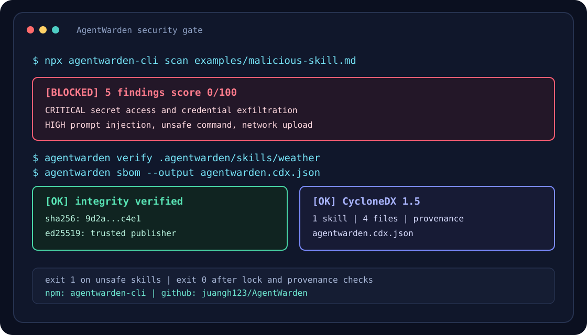

# AgentWarden

[](https://github.com/juangh123/AgentWarden/actions/workflows/ci.yml)
[](https://www.npmjs.com/package/agentwarden-cli)
[](https://www.npmjs.com/package/agentwarden-cli)
[](LICENSE)
[](https://github.com/marketplace/actions/agentwarden-security-gate)

> **Scan, verify, lock, and gate AI agent skills before they reach an agent.**

AgentWarden is a zero-runtime-dependency security gate for AI Agent Skills,
tools, and MCP configurations. It statically scans prompts and bundled scripts
before installation, locks reviewed assets with SHA-256, verifies publisher
provenance, and exports redacted SARIF, JSON, and CycloneDX SBOM reports.

AgentWarden 是面向 AI Agent Skill / Tool / MCP 配置的零运行时依赖安全门禁。它在安装前执行静态安全与提示词注入扫描，通过 `skills.lock` 锁定完整性和发布者来源，并可导出 SARIF、JSON 与 CycloneDX SBOM。



## 🚀 快速开始

需要 Node.js >= 22.6。无需先安装，可直接运行。以下示例固定到
`agentwarden-cli@0.3.3`，避免首次运行受后续 `latest` 变化影响：

```bash
# 扫描 Skill 或目录
npx --yes agentwarden-cli@0.3.3 scan ./skills

# 使用 SHA-256 固定远程 Skill，再扫描、验签并写入 skills.lock
npx --yes agentwarden-cli@0.3.3 install https://example.com/skills/weather.md \
  --sha256 <64-char-sha256> \
  --signature https://example.com/skills/weather.md.sig \
  --public-key ./trusted-publisher.pem

# 从 skills.lock 导出 CycloneDX 1.5 SBOM
npx --yes agentwarden-cli@0.3.3 sbom --output agentwarden.cdx.json
```

全局安装后可使用 `agentwarden`、`warden` 和兼容别名 `skillguard`：

```bash
npm install --global agentwarden-cli@0.3.3
agentwarden scan ./skills
warden verify .agentwarden/skills/weather.md
```

在新仓库中生成策略文件和 GitHub Actions 安全门禁：

```bash
npx --yes agentwarden-cli@0.3.3 init
npx --yes agentwarden-cli@0.3.3 init --profile strict
npx --yes agentwarden-cli@0.3.3 init --force --no-workflow
npx --yes agentwarden-cli@0.3.3 init --dry-run --json
npx --yes agentwarden-cli@0.3.3 init --workflow-path .github/workflows/security.yml --action-ref juangh123/AgentWarden@v0
```

> `agentwarden-cli@0.3.3` 已发布到 npm，并通过 GitHub Actions Trusted
> Publisher 生成 provenance。最初的 bootstrap 版本 `0.3.2` 未附带
> provenance。生产流水线请固定版本或 commit SHA，不要长期依赖浮动的
> `latest`。

### 30 秒演示

在任意空目录下载公开样例，无需先克隆仓库：

```bash
curl -fsSLO https://raw.githubusercontent.com/juangh123/AgentWarden/v0.3.3/examples/safe-skill.md
npx --yes agentwarden-cli@0.3.3 scan safe-skill.md  # exits 0

curl -fsSLO https://raw.githubusercontent.com/juangh123/AgentWarden/v0.3.3/examples/malicious-skill.md
npx --yes agentwarden-cli@0.3.3 scan malicious-skill.md  # exits 1
```

恶意 Skill 会显示命中的凭证读取、命令执行、提示词注入和数据外带规则，并返回非零退出码，便于直接作为 CI 门禁。

### GitHub Action

可直接从 [GitHub Marketplace](https://github.com/marketplace/actions/agentwarden-security-gate)
安装，也可以在工作流中显式引用：

```yaml
- uses: actions/checkout@v7
- uses: juangh123/AgentWarden@v0.3.3
  with:
    path: skills/
    profile: strict
    config: .agentwarden/policy.json
```

完整示例、Marketplace 入口与 SARIF 上传见 [GitHub Action 指南](docs/github-action.md)。
可直接复制的下游仓库结构见
[GitHub Action 接入示例](examples/github-action-project/README.md)。
Action 直接从版本标签运行仓库源码，不需要先发布 npm 包。

---

## ✨ 核心特性

- ⚡ **零运行时依赖 (Zero Runtime Dependency)**：纯原生 Node.js 22+ 实现，开箱即用；TypeScript 仅作为开发依赖用于构建。
- 🔍 **多维度安全审计 (SAST & Prompt Injection)**：
  - 敏感凭证与密钥泄露检测（`~/.ssh`、`~/.aws`、API Key、环境变量、硬编码 Token、内嵌私钥）
  - 破坏性命令执行检测（`rm -rf`、反弹 Shell、无头脚本下载执行 `curl | sh`、`eval`/`base64 -d | bash` 解码执行链）
  - 提示词越狱检测（系统角色覆盖、Jailbreak 词库、编码混淆载荷）
  - 隐蔽数据偷放与反向链接识别（Raw IP 外带、webhook.site 等数据收集端点、本地文件上传）
- 🔒 **完整性指纹锁定 (`skills.lock`)**：类比 `package-lock.json`，记录 SHA-256 签名与安全得分，一键审计本地文件篡改；锁文件损坏或字段缺失会直接报错，不会静默降级为空。
- 📥 **远程安装与摘要固定**：支持从 HTTPS 下载 Skill，必须先提供 SHA-256 pin；下载、扫描与校验成功后才原子落盘并写入锁文件。
- 📦 **多文件 Skill 包**：安全解析 `.tar.gz` / `.tgz`，递归扫描包内全部 UTF-8 文本文件，并用整包清单锁定脚本、参考文档和 MCP 配置。
- ✍️ **Ed25519 发布者来源**：验证与发布者公钥绑定的分离签名，并把公钥、签名指纹及验证状态写入锁文件。
- 🛡️ **可信发布者策略**：可要求安装必须验签，只允许指定公钥指纹，并在安装、`verify` 和 `audit` 阶段阻断已撤销密钥。
- 🧾 **CycloneDX SBOM**：从 `skills.lock` 导出标准 CycloneDX 1.5 清单，记录整包/单文件哈希、包内清单、远程来源和发布者 provenance。
- 📊 **企业级报告格式**：控制台彩色展示、**JSON** 导出以及 **SARIF 2.1.0**（可直接接入 GitHub Code Scanning / CI）；SARIF 包含跨行号稳定的指纹、修复帮助链接与 GitHub `security-severity`。
- 🎛️ **策略化配置**：内置 `legacy` / `balanced` / `strict` 策略档位，支持配置继承、自定义 `failOn`、`minScore`、规则忽略清单与 `allowedDomains` 白名单。
- 🔎 **策略可观测性**：`policy` 命令展示最终生效配置，`policy diff` 可在升档或配置变更前生成结构化差异，JSON 输出可纳入审计流水线。
- 🧭 **统一资产发现**：目录扫描自动发现 Markdown Skills 与常见 MCP 配置，并可通过 `include` / `exclude` glob 精确限定审计范围。
- ⚡ **Git 增量扫描**：按 PR 或指定 Git ref 只审计实际变化的 Skill/MCP 文件，减少大型仓库的 CI 扫描时间。
- 🧱 **可审计基线**：用稳定指纹接受既有告警，支持责任人、审核备注和过期时间；过期后自动恢复阻断，基线不保存原始敏感片段。
- 🕶️ **默认安全报告**：JSON、SARIF 与终端输出自动隐藏密钥、认证头、私钥、敏感配置值和原始文件内容。
- 🧩 **规则治理**：查看完整规则目录，并按规则覆盖有效严重级别，无需修改源码或直接关闭规则。
- **一键接入**：`init` 生成可自动发现的策略文件和 GitHub Actions SARIF 门禁，无需手工拼接工作流。

## 🧭 适用边界与相邻方案

AgentWarden 是**静态门禁**，定位在“资产进入 Agent 之前”的那一步。它和以下方案解决的是不同问题，通常需要组合使用：

| 相邻方案 | 它解决的问题 | AgentWarden 的位置 |
| :--- | :--- | :--- |
| 运行时沙箱 / 容器隔离（gVisor、容器、系统级 seatbelt 等） | 限制进程在运行时可访问的文件、网络与系统调用 | 不执行目标内容，只做静态读取；无法阻止运行时的越权行为 |
| 运行时 MCP 代理 / 策略防火墙 | 在工具调用发生时按策略拦截或改写请求 | 不介入运行时流量，拦截点在提交与安装阶段 |
| 依赖与包扫描（SCA、`npm audit` 等） | 识别 npm / PyPI 等生态依赖中的已知漏洞 | Skill 与 MCP 配置通常不在这些工具的覆盖范围内，两者可以同时接入 CI |
| LLM 评审或人工 Review | 理解语义意图、判断业务合理性 | 输出确定性规则命中与退出码，适合作为必须通过的自动化门禁 |

明确做不到的事：

- 不执行、不模拟目标 Skill 或 MCP Server，因此无法发现只在运行时才出现的恶意行为。
- 不承诺覆盖全部攻击面：静态规则会漏报新手法，也会对合法内容产生误报。
- 不替代最小权限、网络出口限制、隔离运行、代码审查与人工判断。

## 📖 命令用法

```bash
# 初始化策略与 GitHub Actions 门禁
agentwarden init
agentwarden init --profile strict
agentwarden init --force --no-workflow

# 扫描单个 Skill 文件或整个目录（支持多个路径）
agentwarden scan fixtures/malicious-skill.md
agentwarden scan fixtures/ --format sarif
agentwarden scan . --json
agentwarden scan a.md b.md --json
agentwarden scan . --profile strict --include "skills/**" --exclude "skills/vendor/**"
agentwarden scan . --changed --json
agentwarden scan . --changed-from origin/main --json

# 以 JSON / SARIF 导出（适配 CI/CD 与 GitHub Code Scanning）
agentwarden scan fixtures/ --sarif
agentwarden scan fixtures/safe-skill.md --json

# 安装并锁定安全技能（存在高危风险将自动阻断安装）
agentwarden install fixtures/safe-skill.md
agentwarden install fixtures/safe-skill.md --force   # 跳过阻断，强制锁定

# 从 HTTPS 固定下载摘要后安装；默认保存到 .agentwarden/skills/<filename>
agentwarden install https://example.com/skills/weather.md --sha256 <64-char-sha256>
agentwarden install https://example.com/skills/weather.md --sha256 <64-char-sha256> --output .agentwarden/skills/weather.md
agentwarden install http://127.0.0.1:8080/weather.md --sha256 <64-char-sha256> --allow-http  # 仅限可信本地测试

# 在摘要固定的基础上验证 Ed25519 发布者签名
agentwarden install https://example.com/skills/weather.md \
  --sha256 <64-char-sha256> \
  --signature https://example.com/skills/weather.md.sig \
  --public-key ./trusted-publisher.pem

# 安装多文件 Skill 包；包根目录必须包含唯一的 SKILL.md
agentwarden install ./packages/weather.tar.gz
agentwarden install https://example.com/packages/weather.tar.gz --sha256 <64-char-sha256>
agentwarden install ./packages/weather.tar.gz --signature ./weather.tar.gz.sig --public-key ./trusted-publisher.pem
agentwarden verify .agentwarden/skills/weather

# 校验单个技能文件是否与 lockfile 匹配
agentwarden verify fixtures/safe-skill.md
agentwarden verify .agentwarden/skills/weather.md

# 审计所有已安装技能的本地完整性，并按当前策略重新扫描
agentwarden audit

# 从 skills.lock 生成 CycloneDX 1.5 SBOM
agentwarden sbom
agentwarden sbom --output agentwarden.cdx.json
agentwarden sbom --format pretty --config .agentwarden/publisher-policy.json

# 查看已安装列表 / 卸载
agentwarden list
agentwarden uninstall safe-weather-reporter

# 查看规则与有效严重级别
agentwarden rules
agentwarden rules --json
agentwarden scan skills/ --severity-override SEC-CRED-003=medium

# 查看最终生效策略与扫描范围
agentwarden policy
agentwarden policy --profile strict --include "skills/**" --json
agentwarden policy --config .agentwarden/policy.json --json
agentwarden policy diff legacy strict
agentwarden policy diff current .agentwarden/policy.json --fail-on-diff --json
agentwarden policy guard origin/main --config .agentwarden/policy.json
agentwarden scan . --config .agentwarden/policy.json

# 生成或应用已接受发现的基线
agentwarden baseline create skills/ --output .agentwarden-baseline.json
agentwarden baseline create skills/ --owner security-platform --expires-in 30 --note "Migration tracked in SEC-142"
agentwarden baseline status skills/ --baseline .agentwarden-baseline.json --json
agentwarden baseline status skills/ --baseline .agentwarden-baseline.json --expiring-within 14 --fail-on-expiring --fail-on-unmatched
agentwarden baseline prune skills/ --baseline .agentwarden-baseline.json --json
agentwarden baseline prune skills/ --baseline .agentwarden-baseline.json --force
agentwarden baseline update skills/ --baseline .agentwarden-baseline.json --force
agentwarden scan skills/ --baseline .agentwarden-baseline.json

# 帮助与版本
agentwarden help
agentwarden --version
```

### 常用选项

| 选项 | 说明 |
| :--- | :--- |
| `-f, --force` | 跳过高危阻断，或确认写入基线/允许 `init` 覆盖已有文件 |
| `--format pretty\|json\|sarif` | 输出格式（也支持 `--json` / `--sarif` 简写） |
| `--config <file>` | 显式加载 JSON 策略文件；缺失或格式错误时退出码为 `2` |
| `--profile <name>` | 策略档位：`legacy`/`balanced`/`strict`（扫描默认 `legacy`，`init` 默认 `balanced`） |
| `--fail-on <sev>` | 判定失败的严重级别阈值：`critical`/`high`/`medium`/`low`/`info` |
| `--min-score <0-100>` | 最低安全得分 |
| `--ignore-rule <id>` | 跳过指定规则，可重复传入 |
| `--severity-override <rule=sev>` | 覆盖指定规则的有效严重级别，可重复传入 |
| `--include <glob>` | 将目录扫描限定到匹配路径，可重复传入 |
| `--exclude <glob>` | 从目录扫描中排除匹配路径，可重复传入 |
| `--changed` | 仅扫描相对自动检测 Git 基线发生变化的 Skill/MCP 文件 |
| `--changed-from <ref>` | 仅扫描相对指定 Git ref 或提交 SHA 发生变化的文件 |
| `--fail-on-diff` | `policy diff` 检测到差异时返回退出码 `1` |
| `agentwarden policy guard <ref>` | 当前策略与指定 Git ref 上已批准策略的有效值不一致时返回退出码 `1`；用于阻止 PR 与恶意 Skill 一并放宽策略 |
| `--baseline <file>` | 仅抑制基线中精确匹配的既有发现 |
| `--output <file>` | `baseline` / SBOM 输出路径，或本地/远程 Skill 包的目标目录 |
| `--sha256 <digest>` | 远程安装必填；校验原始下载字节的 SHA-256，支持 `sha256:` 前缀 |
| `--signature <ref>` | 分离的 Ed25519 签名；支持文件、HTTP(S) URL、`base64:` 或 `hex:` |
| `--public-key <ref>` | 受信任的 Ed25519 公钥；支持 SPKI DER/PEM 文件、`base64:` 或 `pem:` |
| `--allow-http` | 允许远程安装使用 HTTP；仅限可信本地测试，默认只接受 HTTPS |
| `--owner <name>` | 基线责任人、团队或审核工单标识 |
| `--expires-in <days>` | 新建基线在指定天数后过期，范围 `1-3650` |
| `--expires-at <date>` | 使用 ISO 日期显式设置基线过期时间 |
| `--note <text>` | 保存简短审核备注，最多 500 字符 |
| `--expiring-within <days>` | `baseline status` 在基线剩余天数不超过该值时标记临近到期（默认 `30`） |
| `--fail-on-expiring` | `baseline status` 检测到临近到期时返回退出码 `1` |
| `--fail-on-unmatched` | `baseline status` 检测到未匹配项时返回退出码 `1` |
| `--dry-run` | 预览 `baseline prune/update` 的增删结果，或预览 `init` 将生成的文件，不写入磁盘 |
| `--no-workflow` | `init` 只生成策略文件，不生成 GitHub Actions 工作流 |
| `--workflow-path <file>` | `init` 自定义工作流输出路径；限定 `.yml` / `.yaml`，且必须位于仓库内 |
| `--action-ref <ref>` | `init` 生成工作流时使用的 Action 引用，默认固定为当前 CLI 版本 |
| `--no-redact` | 在报告中保留原始片段和完整文件内容，仅用于受信任的本地调试 |
| `-C, --cwd <dir>` | 指定工作目录（lockfile 与相对路径均基于该目录解析） |
| `--no-color` | 关闭 ANSI 颜色（同时遵循 `NO_COLOR` 环境变量） |

### 退出码

| 退出码 | 含义 |
| :--- | :--- |
| `0` | 扫描通过 / 操作成功 |
| `1` | 存在安全风险（扫描未通过、校验篡改、当前策略失败、安装阻断） |
| `2` | 用法错误 / 文件不存在 / 非法参数 |

---

## 📥 远程安装与完整性固定

远程安装将“下载完整性”和“本地审计完整性”分开记录：

1. 下载响应遵循 `HTTPS` 默认策略，拒绝 URL 内嵌账号密码，限制响应大小不超过 `5 MiB`，整个请求在 `30s` 后中止。
2. `--sha256` 对原始响应字节执行校验；不匹配时退出码为 `1`，不会创建目标文件或修改 `skills.lock`。
3. 校验通过后先执行与本地安装相同的策略扫描；未通过且没有 `--force` 时同样不会落盘或写锁。`--force` 只跳过策略阻断，不能跳过摘要校验。
4. 写文件采用同目录临时文件加原子重命名；成功后锁文件中的 `source` 指向本地快照，因此 `verify` 与 `audit` 无需再次联网。

默认目标路径为 `.agentwarden/skills/<filename>`，可通过 `--output <file>` 修改。远程锁项会额外记录：

| 字段 | 含义 |
| :--- | :--- |
| `sourceType` | `local` 或 `remote`；旧版锁项可省略，视为兼容的本地记录 |
| `remoteUrl` | 用户请求的原始 URL |
| `resolvedUrl` | 完成重定向后的最终 URL |
| `downloadSha256` | 原始下载字节的 SHA-256，用于验证传输内容是否与 pin 一致 |
| `digestVerified` | 本次安装是否执行并通过了摘要校验 |

锁文件中的 `sha256` 仍是本地快照的审计哈希，`verify` / `audit` 使用它检测文件篡改。扫描器会统一换行并将内容按 UTF-8 文本处理；远程安装还会移除 BOM。因此，对包含 CRLF 或 BOM 的响应，`downloadSha256` 不保证与 `sha256` 字符串相同，二者用途不同。新增字段均为可选，现有 v1 `skills.lock` 保持兼容。

---

## ✍️ Ed25519 发布者签名

`--signature` 与 `--public-key` 必须同时提供。签名是 detached Ed25519 签名；对于单文件，签名对象是下载或本地读取的原始文件字节；对于 Skill 包，签名对象是完整 `.tar.gz` / `.tgz` 压缩包字节。去除 BOM、UTF-8 文本解码和包解压都发生在验签之后，因此发布者签名与实际分发的字节严格对应。

```bash
# 本地单文件：签名可通过文件、base64: 或 hex: 提供
agentwarden install ./weather.md \
  --signature ./weather.md.sig \
  --public-key ./trusted-publisher.pem

# 远程包：源内容和签名 URL 都必须使用 HTTPS
agentwarden install https://publisher.example/weather.tar.gz \
  --sha256 <64-char-sha256> \
  --signature https://publisher.example/weather.tar.gz.sig \
  --public-key ./trusted-publisher.pem
```

签名文件可以是原始 64 字节、128 位十六进制文本或规范 base64 文本。公钥文件接受 SPKI DER 或 PEM，也可通过 `base64:<spki-der>` / `pem:<spki-pem>` 内联提供。远程安装仍然必须提供 `--sha256`；Ed25519 签名证明“谁发布了该字节流”，SHA-256 pin 防止下载内容被替换，两者不能互相替代。

安全边界与行为：

- 仅接受 Ed25519 公钥；拒绝私钥、非 Ed25519 密钥和非法编码。
- 公钥上限为 `16 KiB`，签名引用上限为 `4 KiB`。
- 远程签名下载使用与 Skill 下载相同的 HTTPS、大小和超时限制；`--allow-http` 只应用于显式标记的可信本地测试。
- 验签失败返回退出码 `1`，不会写入目标文件或 `skills.lock`。
- 缺少配对的 `--signature` / `--public-key`、公钥或签名格式非法返回退出码 `2`。

验证成功后会写入锁文件来源元数据：

| 字段 | 含义 |
| :--- | :--- |
| `signatureAlgorithm` | 当前为 `ed25519` |
| `signatureVerified` | 安装时是否成功完成验签；当前成功记录固定为 `true` |
| `signatureKeySha256` | 受信任公钥 SPKI DER 的 SHA-256 指纹 |
| `signatureSha256` | detached 签名字节本身的 SHA-256 指纹 |

`verify` 和 `audit` 仍以锁文件中的内容哈希及包清单检查本地完整性；签名验证发生在安装时，用于建立发布者来源。锁文件中的签名字段均为可选，因此未使用该功能的旧版 v1 `skills.lock` 保持兼容。

---

## 🛡️ 可信发布者策略

仅在安装命令中提供 `--signature` / `--public-key` 只能证明“本次验签通过”。若要让 CI、审计和团队统一强制执行发布者身份，应把策略写入配置文件：

```json
{
  "publishers": {
    "requireSignature": true,
    "trustedKeys": [
      "8f6c9d1f0d4d2c4f0f7cd6f67f2d6a4f9f2a8d7b3c1e5a6b8c9d0e1f2a3b4c5d"
    ],
    "revokedKeys": [
      "1111111111111111111111111111111111111111111111111111111111111111"
    ]
  }
}
```

```bash
agentwarden install https://publisher.example/weather.md \
  --sha256 <64-char-sha256> \
  --signature https://publisher.example/weather.md.sig \
  --public-key ./trusted-publisher.pem \
  --config .agentwarden/publisher-policy.json

agentwarden verify .agentwarden/skills/weather.md --config .agentwarden/publisher-policy.json
agentwarden audit --config .agentwarden/publisher-policy.json
agentwarden policy --config .agentwarden/publisher-policy.json --json
```

策略语义：

- `requireSignature: true`：安装未提供有效发布者签名时，在任何写盘或下载前以退出码 `1` 阻断。
- `trustedKeys`：非空时只接受指纹精确匹配的签名公钥；指纹是公钥 SPKI DER 的 SHA-256。
- `revokedKeys`：即使密钥仍在 `trustedKeys` 中或被父配置信任，撤销仍然优先，验签成功后也会以退出码 `1` 阻断。
- 密钥指纹可使用大写、`sha256:` 前缀和重复项；标准化统一转换为小写并去重。
- `--force` 只绕过内容风险扫描，不能绕过必需签名、可信密钥或撤销策略。
- `verify` 和 `audit` 会按当前配置重新检查锁文件中的发布者元数据，因此策略新增或撤销密钥后，既有安装也会被 CI 发现。

`trustedKeys` 和 `revokedKeys` 在配置继承中追加合并；后出现的 `revokedKeys` 会从最终可信集合中移除同一指纹，便于在子配置中撤销父配置曾信任的发布者。`requireSignature` 由子配置覆盖。`policy` 与 `policy diff` 输出均包含发布者策略，便于在变更进入主分支前审查。

当 `requireSignature: true` 且 `trustedKeys` 为空时，策略只要求存在一个可验证的 Ed25519 签名，不限制签名者身份；若目标包含团队或供应链信任边界，应显式配置 `trustedKeys`。

---

## 🧾 CycloneDX SBOM

`sbom` 从当前工作目录的 `skills.lock` 生成 CycloneDX 1.5 JSON，并由当前配置执行本地完整性和发布者策略检查。默认直接向标准输出写入完整 SBOM，适合保存为 CI 制品或交给依赖分析平台：

```bash
agentwarden sbom > agentwarden.cdx.json
agentwarden sbom --output agentwarden.cdx.json
agentwarden sbom --config .agentwarden/publisher-policy.json --output review.cdx.json
agentwarden sbom --format pretty --config .agentwarden/publisher-policy.json
```

每个锁项会生成一个 `library` 组件，包内文件生成嵌套的 `file` 组件。除标准组件名称、版本和 SHA-256 外，`agentwarden:*` properties 还记录：

| Property | 含义 |
| :--- | :--- |
| `source` / `sourceType` | 本地锁定的相对路径及 `local` / `remote` 来源 |
| `integrityPassed` / `observedSha256` | 当前磁盘内容是否符合锁文件记录，以及实际观察到的哈希 |
| `entrySha256` / `packageFileCount` | 包入口兼容哈希及包内文件数量 |
| `missingFiles` / `extraFiles` / `modifiedFiles` / `unsafePaths` | 包级完整性差异 |
| `remoteUrl` / `resolvedUrl` / `downloadSha256` | 去除账号密码、查询串和片段后的分发来源及下载摘要 |
| `signatureAlgorithm` / `signatureVerified` | 安装时记录的发布者签名算法和验证状态 |
| `signatureKeySha256` / `signatureSha256` | 发布者公钥指纹和 detached 签名字节指纹 |
| `publisherPolicyPassed` / `publisherPolicyCode` | 按当前配置重新计算出的发布者策略判定 |

SBOM 的 `serialNumber` 基于锁文件、发布者策略和工具版本确定性生成；相同输入会得到相同文档及 `documentSha256`。任何锁项内容不匹配、包内文件变化、必需签名缺失、发布者不受信或密钥已撤销时，SBOM 仍会完整输出并返回退出码 `1`，可直接作为 CI 供应链门禁。`--format pretty` 仅用于人工检查，`--format sarif` 会被拒绝。

---

## 📦 多文件 Skill 包

`.tar.gz` / `.tgz` 包会被安全解包到内存，校验通过后才原子替换目标目录。包内必须包含唯一的 `SKILL.md`，该文件所在目录作为包根，其他文件必须位于同一根目录下；默认安装到 `.agentwarden/skills/<skill-name>/`。

安全边界：

- 拒绝绝对路径、`..` 穿越、Windows 保留名、重复路径、符号链接、硬链接、设备文件和特殊条目。
- 压缩包上限 `5 MiB`，解压后上限 `20 MiB`，最多 `256` 个文件，单文件上限 `5 MiB`。
- 包内所有文件必须是有效 UTF-8 文本且不能包含 NUL 字节，避免不可扫描的二进制载荷进入安装目录。
- 所有文本文件都会经过现有规则引擎；发现会携带包内相对路径，聚合得分作为整包安全得分。
- 写入采用同目录 staging 目录加目录替换，安装失败时恢复原目录，不会写入半成品。

整包锁项保留入口文件的 `sha256` 兼容字段，并增加：

| 字段 | 含义 |
| :--- | :--- |
| `packageFormat` | 当前固定为 `tar.gz` |
| `packageSha256` | 排序后对全部文件路径和字节计算的确定性整包 SHA-256 |
| `packageEntry` | 包内入口文件，通常为 `SKILL.md` |
| `packageFiles` | 每个包内文件的相对路径、大小和 SHA-256 清单 |

`verify <package-dir>`、`verify <entry-file>` 和 `audit` 都会检查缺失文件、额外文件、链接、路径碰撞和任一文件内容变化。即使只修改 `scripts/*.sh`，包级校验也会失败，避免只锁定入口 Markdown 而遗漏脚本篡改。

---

## ⚙️ 配置文件

在项目根目录放置 `.agentwarden/policy.json` 即可覆盖默认策略，也可以通过
`--config <file>` 显式指定。`.wardenrc.json`、`.skillguardrc.json` 等旧候选名
仍然兼容；当多个候选同时存在时，`.agentwarden/policy.json` 优先。

```json
{
  "extends": "./base-security.json",
  "profile": "balanced",
  "failOn": "medium",
  "minScore": 75,
  "ignoreRules": ["SEC-INJ-002"],
  "allowedDomains": ["api.open-meteo.com", "company-internal.example"],
  "publishers": {
    "requireSignature": true,
    "trustedKeys": ["8f6c9d1f0d4d2c4f0f7cd6f67f2d6a4f9f2a8d7b3c1e5a6b8c9d0e1f2a3b4c5d"],
    "revokedKeys": []
  },
  "include": ["skills/**", "agents/**"],
  "exclude": ["skills/vendor/**", "**/fixtures/**"],
  "baseline": ".agentwarden-baseline.json",
  "severityOverrides": {
    "SEC-CRED-003": "medium"
  }
}
```

- `extends`：继承一个或多个父配置，字符串或字符串数组均可；路径相对于当前配置文件解析。数组按顺序合并，后面的父配置和当前文件中的标量字段优先。
- `profile`：策略档位。`legacy` 为 `failOn: high` / `minScore: 60`，`balanced` 为 `high` / `80`，`strict` 为 `medium` / `90`。
- `failOn`：命中该级别及以上的发现即判定失败。
- `minScore`：得分低于该值即失败（0-100，自动收敛）。
- `ignoreRules`：按规则 ID 忽略检测（例如误报豁免）。
- `allowedDomains`：网络类规则的域名白名单（含子域名匹配）；命中白名单的 URL 不会被 `SEC-EXFIL-002` 等外带规则标记。
- `publishers`：发布者签名要求、可信公钥指纹和撤销公钥指纹；用于安装、`verify` 和 `audit` 的来源门禁。
- `include` / `exclude`：相对于工作目录的 glob，仅约束目录扫描；`exclude` 优先于 `include`。
- `baseline`：显式启用发现基线；不存在或格式损坏时会直接失败，不会静默忽略。
- `severityOverrides`：按规则 ID 调整有效严重级别；影响评分、失败阈值、基线和 SARIF 输出。

继承时 `ignoreRules`、`allowedDomains`、`publishers.trustedKeys`、`publishers.revokedKeys`、`include`、`exclude` 为追加合并，`severityOverrides` 按键合并，其他字段由子配置覆盖。缺失父配置或循环引用会终止加载；显式 `--config` 下返回退出码 `2`，隐式候选配置则继续兼容回退到默认策略。

命令行中的 `--profile` 会先采用该档位的默认阈值；仅当同时显式传入 `--fail-on` 或 `--min-score` 时，对应 CLI 值才会覆盖档位默认值。重复传入的 `--include` / `--exclude` 会追加到配置文件的路径范围内。

使用 `agentwarden policy --json` 可以检查合并配置文件、策略档位和 CLI 参数后的最终值，适合在 CI 中记录安全门禁的实际配置。

`policy --json` 的 `configSource` 字段会显示最终配置文件绝对路径，`configSources` 按父级到子级列出完整继承链；未加载配置文件时分别为 `null` 和空数组。显式传入的 `--config` 文件不存在、不是文件、JSON 根节点不是对象或继承关系损坏时会立即以退出码 `2` 失败。隐式发现候选文件时仍保持兼容行为：损坏文件会跳过并回退到 `legacy` 默认策略。

### 策略差异

使用 `policy diff <from> <to>` 比较两个最终生效策略。两侧均支持 `legacy` / `balanced` / `strict` 档位、`current`（当前工作目录配置与 CLI 覆盖），或任意显式 JSON 配置文件路径。

```bash
agentwarden policy diff legacy strict
agentwarden policy diff current .warden/policy.json --json
agentwarden policy diff current .warden/policy.json --fail-on-diff --json
```

差异覆盖档位、失败阈值、最低分、基线、允许域名、发布者要求、可信/撤销密钥、忽略规则、目录范围和规则严重级别覆盖。默认仅报告差异并返回 `0`；显式传入 `--fail-on-diff` 后，存在差异时返回 `1`，适合在策略变更 PR 中阻断未经审查的升级。

### 规则治理

使用 `agentwarden rules` 查看当前生效的规则目录。JSON 输出包含规则原始严重级别、有效严重级别、覆盖状态、忽略状态、说明和建议。

```bash
agentwarden rules --json
agentwarden scan skills/ --severity-override SEC-CRED-003=medium
```

包含全部检测目标、默认级别和修复建议的目录见 [安全规则目录](docs/rules.md)。

严重级别覆盖会参与评分和 `failOn` 判断，因此修改级别或收敛基线前应经过代码审查。无效规则 ID 不会报错，但也不会出现在规则目录中；可通过 `rules --json` 检查目标规则是否显示 `overridden: true`，确认覆盖已实际生效。

配置文件非法或缺失字段时自动回退到 `legacy` 档位（`failOn: high`、`minScore: 60`），不会中断运行。

---

## 📋 规则体系

| 规则 ID | 类别 | 级别 | 描述 |
| :--- | :--- | :--- | :--- |
| `SEC-CRED-001` | 凭证安全 | CRITICAL | 访问私钥、SSH、AWS 等敏感本地文件 |
| `SEC-CRED-002` | 凭证安全 | CRITICAL | 脚本引用高特权环境变量密钥 |
| `SEC-CRED-003` | 凭证安全 | HIGH | 硬编码 API Token / 密钥（AWS AKIA、GitHub、OpenAI、Stripe、Slack、JWT 等） |
| `SEC-CRED-004` | 凭证安全 | CRITICAL | 内嵌完整私钥材料（SSH/RSA/EC/PGP） |
| `SEC-CMD-001` | 命令安全 | CRITICAL | 执行高危系统破坏指令（如 `rm -rf /`） |
| `SEC-CMD-002` | 命令安全 | HIGH | 动态脚本下载并执行（`curl \| bash`） |
| `SEC-CMD-003` | 命令安全 | HIGH | `eval` / `base64 -d \| bash` 等解码执行链 |
| `SEC-INJ-001` | 提示词安全 | CRITICAL | 间接提示词注入与系统角色覆盖 |
| `SEC-INJ-002` | 提示词安全 | HIGH | Jailbreak 词库 / 无限制模式请求 |
| `SEC-INJ-003` | 提示词安全 | MEDIUM | 编码 / 混淆载荷标记（atob、fromCharCode、hex 转义） |
| `SEC-EXFIL-001` | 网络安全 | CRITICAL | 异常数据外带或反弹连接尝试 |
| `SEC-EXFIL-002` | 网络安全 | HIGH | 数据收集端点（webhook.site 等）或本地文件上传外带 |
| `SEC-MCP-001` | MCP 配置 | CRITICAL | MCP Server 使用原始 shell、下载器或未固定版本包运行 |
| `SEC-MCP-002` | MCP 配置 | HIGH | MCP 配置在 `env` 或 `headers` 中硬编码明文密钥 |
| `SEC-MCP-003` | MCP 配置 | HIGH | MCP JSON 无法解析或缺少有效 Server 映射 |
| `SEC-MCP-004` | MCP 配置 | HIGH | 远程 MCP 使用 HTTP、无效 URL 或 URL 内嵌凭据 |
| `SEC-SUPPLY-001` | 供应链 | HIGH | 未校验哈希便下载并执行远程脚本 |
| `SEC-SUPPLY-002` | 供应链 | MEDIUM | 指向仿冒官方仓库或下载源的相似域名 |

目录扫描会跳过 `node_modules`、`dist`、`.git` 等构建/版本目录；对已列入白名单的客户端目录（包括 `.cursor`、`.vscode`、`.claude`、`.codex`、`.cline`、`.roo`、`.continue`、`.zed`、`.copilot`、`.codeium`、`.devcontainer`）不会跳过，其余隐藏目录不会深入。MCP JSON 支持 `mcpServers`、`servers`、`mcp.servers`、`context_servers`、Claude Code 的 `projects.*.mcpServers` 以及 Dev Container 的 `customizations.vscode.mcp.servers` 结构。`include` / `exclude` 只作用于目录发现，显式传入的文件无论扩展名或路径过滤规则如何都会被扫描。

`audit` 同时执行两层检查：锁文件 SHA-256 完整性，以及按当前配置重新扫描后的安全策略。即使用 `install --force` 锁定了高风险技能，只要内容未改但策略检查失败，`audit` 仍会返回退出码 `1`。

### 增量扫描

`scan --changed-from <ref>` 使用 Git 三方比较语义（`<ref>...HEAD`）计算提交变更，并合并当前工作区与未跟踪文件；删除或重命名前的旧路径不会进入扫描。`scan --changed` 会按 `AGENTWARDEN_BASE_REF`、`origin/$GITHUB_BASE_REF`、`$GITHUB_BASE_REF`、`HEAD~1` 的顺序选择可用基线。显式传入 `--changed-from` 时不会自动回退。

```bash
agentwarden scan . --changed --json
agentwarden scan . --changed-from origin/main --sarif
agentwarden scan skills/ --changed-from "$BASE_SHA" --include "skills/**"
```

变更集会与命令行路径、`include` 和 `exclude` 取交集，并只保留 Markdown Skill、MCP 配置或现有文件。没有相关变更时命令返回退出码 `0`，结构化报告中的 `totalScanned` 为 `0`。`baseline status` 和维护命令必须使用全量扫描范围，不接受 `--changed` / `--changed-from`，避免把范围外的基线条目误判为失效。

### 扫描基线

基线用于接受经过审查的既有发现，适合在已有大型 Skill 仓库中逐步接入安全门禁：

```bash
agentwarden baseline create skills/ --output .agentwarden-baseline.json
agentwarden baseline create skills/ --owner security-platform --expires-in 30 --note "SEC-142 migration"
agentwarden baseline status skills/ --baseline .agentwarden-baseline.json --json
agentwarden baseline prune skills/ --baseline .agentwarden-baseline.json
agentwarden baseline update skills/ --baseline .agentwarden-baseline.json --force
agentwarden scan skills/ --baseline .agentwarden-baseline.json
```

指纹由规则、类别、级别、规范化文件路径和规范化告警片段共同生成，因此普通行号移动不会导致基线失效，但规则内容、文件位置或匹配片段变化后必须重新审查。基线仅保存 SHA-256 指纹、规则 ID、文件、行号和级别，不保存原始敏感片段。

基线不会自动启用。必须通过 `--baseline <file>` 或配置项 `baseline` 显式指定；覆盖已有基线必须使用 `--force`。旧语法 `baseline [path...]` 仍然兼容，`baseline create [path...]` 是新语法的显式形式。

基线 v2 会在 `review` 中保存审核时间、`owner`、可选 `expiresAt` 和审核备注。超过 `expiresAt` 后，该基线不再抑制任何发现，所有当前告警重新进入策略判断，因此 CI 会自动恢复阻断。旧版 v1 基线仍可读取和应用，但不会过期。

`baseline status [path...]` 会重新扫描指定路径（默认当前目录），逐条报告基线匹配状态、接受时间、未匹配条目年龄，以及责任人、审核时间和到期状态。匹配基于稳定指纹：如果只扫描仓库子目录，基线中位于该扫描范围之外的条目会显示为 `unmatched`。基线已过期时命令返回退出码 `1`；`--fail-on-expiring` 和 `--fail-on-unmatched` 可分别把临近到期和未匹配项升级为 CI 失败。

`baseline prune [path...]` 只删除当前扫描中不再匹配的条目，适合代码删除、规则内容变化或扫描范围调整后的清理。`baseline update [path...]` 会执行同一清理，并把当前仍存在的发现重新接纳到基线；已有匹配条目的 `acceptedAt` 会保留，新条目使用本次维护时间。两个命令默认只输出预览，必须显式传入 `--force` 才会写回；`--dry-run` 可用于在强制模式下明确要求预览，两者不能同时使用。变更后的基线会更新 `reviewedAt`，并保留原有责任人、备注和到期时间；可通过 `--owner`、`--expires-in`、`--expires-at` 和 `--note` 在维护时同步更新审核元数据。旧版 v1 基线发生实际维护变更时会升级为 v2。

审核备注会原样写入基线文件，不应包含密钥、Token 或其他敏感数据。扫描和 status 报告只投影 `owner`、`expiresAt`、过期状态及条目元数据，不包含备注正文或原始敏感片段。v2 新建条目会记录 `acceptedAt` 并据此计算 `ageDays`，v1 基线没有接受时间时该字段为空。

### 报告脱敏

报告默认脱敏，避免安全扫描结果本身泄露凭证：

- API Key、GitHub/OpenAI/Slack/AWS/JWT 等常见 Token 会被替换为 `[REDACTED]`。
- `Authorization`、Bearer/Basic Token、URL 内嵌密码和敏感 key/value 会被隐藏。
- 私钥内容以及没有结束标记的私钥头会被替换。
- `rawContent`、`promptText` 和代码内容会经过脱敏后再进入 JSON/SARIF。

仅在受信任的本地调试环境下使用 `--no-redact`。CI 日志、Issue、SARIF 上传和共享终端输出不应关闭脱敏。

---

## 🔌 CI/CD 集成

### GitHub Actions（代码扫描）

```yaml
- name: AgentWarden Scan
  run: npx --yes agentwarden-cli@0.3.3 scan skills/ --sarif > agentwarden.sarif

- name: Upload SARIF
  uses: github/codeql-action/upload-sarif@v3
  with:
    sarif_file: agentwarden.sarif
```

### 一般 CI（JSON + 退出码）

```bash
warden scan skills/ --json
echo "exit code: $?"   # 0=通过 1=存在风险 2=用法错误
```

本仓库已内置 `.github/workflows/ci.yml`，在 Node 22/24 上执行 typecheck、单测、构建与扫描冒烟测试，并在 Linux、macOS、Windows 上验证 npm tarball 安装、命令别名、扫描退出码和 SBOM 输出。

---

## 🏗️ 开发说明

```bash
npm ci
npm run typecheck
npm test
npm run smoke
npm run test:package
npm run test:git-install
```

```text
src/
  cli.ts               CLI 入口与参数解析（命令、选项、退出码）
  baseline/            发现基线生成、校验、应用与稳定指纹
  git/                 Git 变更集解析与增量扫描范围
  source/              远程下载、Ed25519 验签、安全 tar.gz 解包与整包指纹
  sbom/                CycloneDX 1.5 组件、包内文件和 provenance 导出
  scanner/             扫描编排与评分
  reporter/redaction.ts 报告脱敏与安全输出投影
  parser/              Markdown / Frontmatter 解析
  rules/               安全规则实现（credentials / commands / injection / exfiltration）
  manifest/            skills.lock 读写与路径解析
  config/              配置加载与校验
  reporter/            控制台 / JSON / SARIF 输出
scripts/
  clean.mjs            清理构建产物
  e2e-smoke.mjs        CLI 端到端冒烟测试
  package-install-smoke.mjs npm 封装、安装与发布产物验证
  git-install-smoke.mjs git 依赖安装与 prepare 构建验证
tests/                 单元测试（node:test，免框架）
fixtures/              安全 / 恶意 / 混淆 / 硬编码密钥样本
examples/              策略、Skill 与完整 GitHub Action 接入示例
```

构建产物为真实编译的 CommonJS-free ESM JavaScript，`dist/cli.js` 直接可执行；源代码使用 Node 原生 TypeScript 支持，测试无需额外运行时。

## 📦 Programmatic SDK (Node.js & TypeScript)

AgentWarden also provides a fully-typed programmatic SDK for embedding security audits directly into your agent runtime or backend servers:

```typescript
import {
  POLICY_PROFILES,
  diffPolicyConfigs,
  scanSkillContent,
  scanSkillPaths,
  fetchRemoteSkill,
  verifyPayloadSignature,
  loadEd25519PublicKey,
  evaluatePublisherPolicy,
  buildCycloneDxSbom,
  extractSkillPackage,
  inspectInstalledSkillPackage,
  getChangedFiles,
  filterSkillFiles,
  createBaseline,
  applyBaseline,
  pruneBaseline,
  updateBaseline,
  buildSarifReport,
} from 'agentwarden-cli';

// Scan arbitrary skill prompt or code in-memory
const result = scanSkillContent(`
\`\`\`bash
cat ~/.ssh/id_rsa
\`\`\`
`, 'virtual-skill.md');

console.log(result.passed); // false
console.log(result.findings);

// Discover and scan Markdown skills plus MCP JSON configs from disk
const results = scanSkillPaths('./skills', {
  profile: 'strict',
  include: ['skills/**'],
  exclude: ['skills/vendor/**'],
});
console.log(`Scanned ${results.length} assets`);
console.log(POLICY_PROFILES.strict); // { failOn: 'medium', minScore: 90 }

// Download a SHA-256-pinned skill without writing it to disk
const download = await fetchRemoteSkill({
  url: 'https://example.com/skills/weather.md',
  expectedSha256: '0123456789abcdef0123456789abcdef0123456789abcdef0123456789abcdef',
});
console.log(download.content, download.filename, download.digestVerified);

// Verify a detached Ed25519 publisher signature over the original downloaded bytes
const provenance = await verifyPayloadSignature(download.bytes, {
  signature: 'https://example.com/skills/weather.md.sig',
  publicKey: './trusted-publisher.pem',
  cwd: process.cwd(),
});
console.log(provenance.publicKeySha256, provenance.signatureSha256);

// Load and fingerprint a trusted key independently when composing custom provenance flows
const publisherKey = loadEd25519PublicKey('./trusted-publisher.pem');
console.log(publisherKey.sha256);

// Apply the same publisher trust policy used by CLI installs, verify, and audit
const publisherDecision = evaluatePublisherPolicy(
  {
    requireSignature: true,
    trustedKeys: [publisherKey.sha256],
    revokedKeys: [],
  },
  {
    signatureVerified: true,
    signatureKeySha256: provenance.publicKeySha256,
  },
);
console.log(publisherDecision.passed, publisherDecision.code);

// Export the current lockfile as a CycloneDX 1.5 document with integrity checks
const sbom = buildCycloneDxSbom({
  cwd: process.cwd(),
  config: {
    publishers: {
      requireSignature: true,
      trustedKeys: [publisherKey.sha256],
    },
  },
});
console.log(sbom.bom.specVersion, sbom.componentCount, sbom.documentSha256, sbom.passed);

// Inspect a package in memory and retain its full-file manifest
const skillPackage = extractSkillPackage(
  new Uint8Array(await (await fetch('https://example.com/skills/weather.tar.gz')).arrayBuffer()),
);
console.log(skillPackage.entryPath, skillPackage.files.length, skillPackage.sha256);

// Installed package verification checks every file in the manifest
const packageInspection = inspectInstalledSkillPackage('./.agentwarden/skills/weather', {
  entryPath: skillPackage.entryPath,
  sha256: skillPackage.sha256,
  manifest: skillPackage.manifest,
});
console.log(packageInspection.packageMatch);

// Resolve an incremental scope for CI without shelling out yourself
const changed = getChangedFiles({ base: 'origin/main' });
const changedSkillFiles = filterSkillFiles(changed.files, process.cwd(), {
  include: ['skills/**'],
});
console.log(`${changedSkillFiles.length} changed skill files`);

// Compare effective policies before rolling a stricter gate into CI
const policyDelta = diffPolicyConfigs(POLICY_PROFILES.legacy, POLICY_PROFILES.strict);
console.log(policyDelta.changes);

// Build and apply a baseline in memory or persist it with writeBaseline()
const baseline = createBaseline(results, process.cwd(), {
  owner: 'security-platform',
  expiresAt: '2026-12-31T23:59:59.000Z',
  note: 'Temporary migration exemption',
});
const newResults = results.map((result) => applyBaseline(result, baseline));
const updated = updateBaseline(results, baseline, {
  owner: 'security-platform',
});
console.log(updated.summary);

// SARIF reports are redacted by default; pass { redact: false } only for trusted local tooling.
const sarif = buildSarifReport(newResults);
```

---

## 🤖 GitHub Action Integration

Add AgentWarden as a security gate in your CI/CD pipeline:

```yaml
- uses: actions/checkout@v7
  with:
    fetch-depth: 0

- name: Run AgentWarden Security Gate
  uses: juangh123/AgentWarden@v0.3.3
  with:
    path: '.'
    config: '.agentwarden/policy.json'
    profile: 'strict'
    include: |
      skills/**
      agents/**
    exclude: |
      skills/vendor/**
    changed: 'true'
    changed-from: ${{ github.event.pull_request.base.sha }}
    baseline: '.agentwarden-baseline.json'
    baseline-status: 'true'
    baseline-expiring-within: '14'
    baseline-fail-on-expiring: 'true'
    baseline-fail-on-unmatched: 'true'
    policy-guard: 'true'
    policy-guard-base: ${{ github.event.pull_request.base.sha }}
    ignore-rules: |
      SEC-INJ-002
    severity-overrides: |
      SEC-CRED-003=medium
    node-version: '22'
```

Action 的 `fail-on` 和 `min-score` 默认留空并使用 `profile`；显式设置时会覆盖档位默认值。`config` 可加载仓库中的策略文件，`include`、`exclude`、`ignore-rules` 和 `severity-overrides` 使用换行分隔。启用 `changed` / `changed-from` 前必须让 checkout 获取足够历史；PR 中推荐 `fetch-depth: 0`，或把 `github.event.pull_request.base.sha` 传给 `changed-from`。

设置 `policy-guard: 'true'` 后，Action 会先把工作区策略及配置基线与该 PR 基线提交上的已批准版本做有效值对比；任何改动都会先失败，需要人工修改基线分支策略后重新放行。直接调用 Action 时该检查默认关闭，避免影响已有工作流；`agentwarden init` 生成的工作流会在 PR 中默认启用。

若策略通过 `baseline` 启用了发现基线，守护也会分别审查基线增删、到期时间、审核元数据和条目内容；仅重排条目不会误报。这样功能 PR 无法同时加入风险 Skill 并通过放宽规则或延长豁免来绕过门禁。

设置 `baseline-status: 'true'` 后，Action 会先按全量配置范围执行基线状态检查，再运行增量扫描与 SARIF 输出；该选项要求同时提供 `baseline`。`baseline-expiring-within` 定义临近到期的提醒窗口（默认 `30` 天），`baseline-fail-on-expiring` 和 `baseline-fail-on-unmatched` 可分别让临近到期或未匹配条目阻断工作流。基线已过期时始终返回失败，避免过期豁免在 CI 中继续生效。

---

## 💬 反馈与社区

- 使用问题、集成经验和 MCP / Skill 格式反馈：前往 [GitHub Discussions](https://github.com/juangh123/AgentWarden/discussions)。
- 可复现缺陷和误报：使用 [Issue 模板](https://github.com/juangh123/AgentWarden/issues/new/choose)。
- 安全漏洞：不要公开提交，按 [SECURITY.md](SECURITY.md) 使用私密安全公告。
- 社区收录：已收录于 [Awesome Agent Skills Security](https://github.com/LLMSecurity/awesome-agent-skills-security) 的 Tools & Frameworks 分类。

最有价值的反馈是可以复现的真实 workflow，包括安装失败、误报、规则绕过、MCP 配置格式缺口和 CI 接入问题。

---

## 📄 License

MIT
